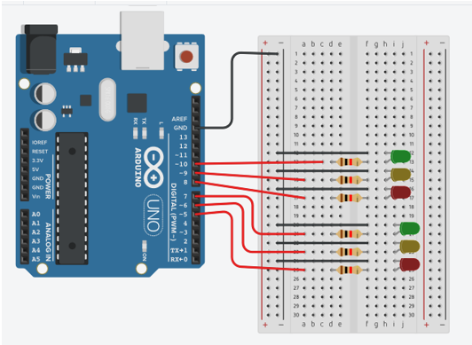
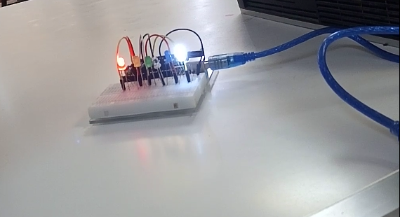

# SistemasProgramables-ArduinoProyects
 Repositorio de Almacenaje de Proyectos de la materia 

**Descripción de la practica:**

Utilizando los componentes necesarios crear un proyecto Arduino que simule un cruce de semáforos.

**Diagrama: **

**Resultado: **

