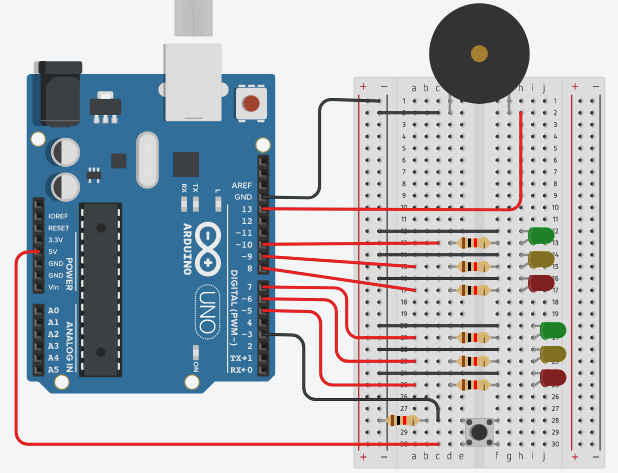

# SistemasProgramables-ArduinoProyects
 Repositorio de Almacenaje de Proyectos de la materia 

**Descripción de la practica:**

Utilizando los componentes necesarios crear un proyecto Arduino que simule un cruce de semáforos.

**Descripción: **

Usando el material necesario cree un proyecto con Arduino que simule un crece de semáforos, con la diferencia que al pulsar un botón haga el cambio de señal y avise usando un buzzer.

**Diagrama: **

**Resultado: **

