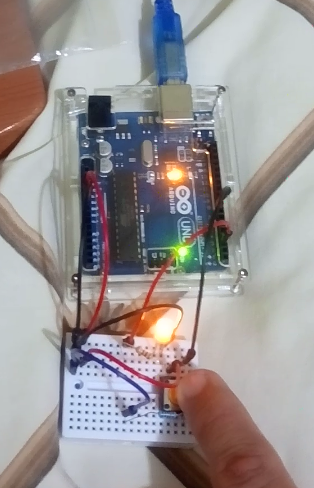
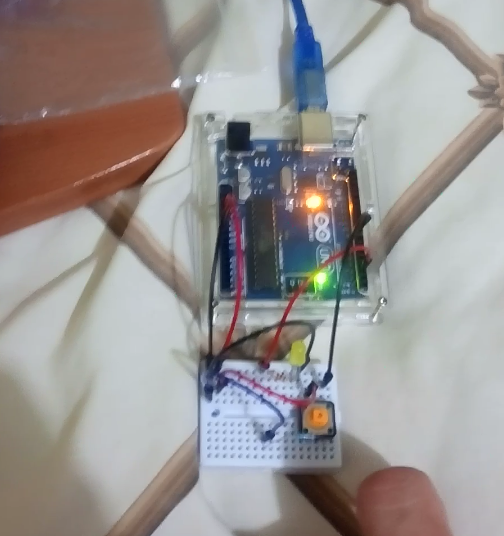

# SistemasProgramables - ArduinoProyects
 Repositorio de Almacenaje de Proyectos de la materia:

**Descripción de la Practica: **

Empleando los materiales necesarios cree un proyecto que permite encender y apagar un led según el estado de un pulsador usando Arduino.

**Diagrama Eléctrico:** 

**Resultados:**

